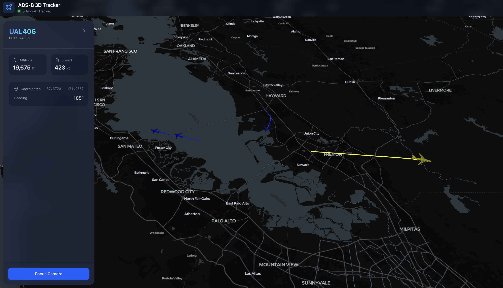
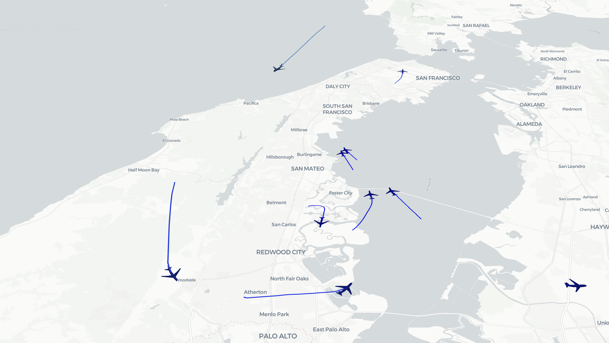
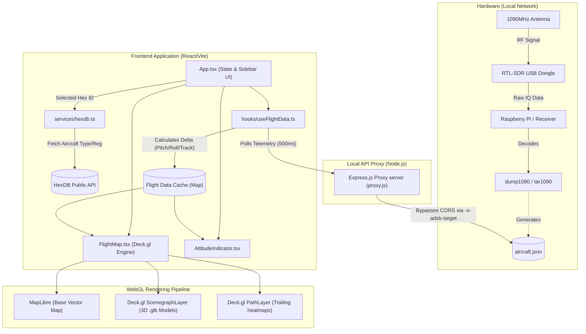

# 🛩️ ADS-B 3D Flight Tracker


A modern, high-performance web application built to visualize live **ADS-B flight telemetry in full 3D**. 

This open-source project directly ingests raw JSON data from local **`dump1090`** or **`tar1090`** receivers—such as those used for **FlightRadar24**, **PiAware**, and **FlightAware** feeders—and leverages **WebGL** to render highly accurate 3D aircraft models seamlessly traversing a geographic map.

## Why this project?
Existing ADS-B dashboards like Tar1090 and Virtual Radar Server (VRS) are fantastic tools, but they primarily operate in an outdated 2D top-down view. This tracker bridges the gap by providing a stunning, highly optimized **3D Glassmorphism interface** inspired by modern flight simulators, making it the perfect "Eye Candy" dashboard for your ADS-B receiver stack.




## Features

- **True 3D Visualization**: Renders actual `.glb` aircraft models using Physically Based Rendering (PBR) lighting via `deck.gl/mesh-layers`.
- **Dynamic Telemetry**: Models correctly pitch, roll, and yaw based on precise headings.
- **Altitude-Based Heatmap**: Aircraft and their historical trailing trajectories are dynamically colored based on their altitude.
- **Sleek Glassmorphism UI**: Built with Tailwind CSS v4, featuring a sliding telemetry sidebar with real-time stats (Altitude, Speed, Heading, Coordinates).
- **Camera Tracking**: Click any plane and use the "Focus Camera" button to smoothly track the aircraft as it flies.
- **Mock Data Engine**: Includes a built-in fake data generator to test the 3D rendering engine even while your receiver is completely offline.
- **CORS-Busting Proxy**: Includes a dedicated standalone local HTTP proxy to easily stream data from external Raspberry Pi endpoints without triggering tight browser security policies.

## Module Architecture



### Frontend (`/src`)
- **`App.tsx`**: The main application shell. Handles React State for the selected camera views, the configuration modal, and the flight details sidebar.
- **`components/FlightMap.tsx`**: The core WebGL engine. Uses `react-map-gl` to render a MapLibre base layer, and overlays `deck.gl` layers (`PathLayer` for trails, `ScenegraphLayer` for 3D GLB planes). Applies real-time dynamic lighting.
- **`hooks/useFlightData.ts`**: The data synchronization brain. 
  - Polls your `dump1090` receiver at an interval.
  - Normalizes legacy telemetry keys (e.g. `altitude` vs `alt_baro`).
  - Calculates movement deltas to continuously draw smooth path trajectories.
  - Generates seamless simulated flight traffic if the target URL is left empty.

### Backend Proxy (`proxy.js`)
- A standalone Express.js server utilizing `http-proxy-middleware`.
- Accepts requests from the frontend at `http://localhost:3001/api/adsb` and robustly pipelines them to your specified ADS-B target via custom `-x-adsb-target` headers, bypassing all Cross-Origin restrictions.

## Setup Instructions

### Prerequisites
- Node.js (v18+)
- A local ADS-B receiver producing a `data/aircraft.json` endpoint (e.g. PiAware, FlightRadar24 feeder, or standard dump1090).
  - *Recommended Hardware:*
    - [Raspberry Pi](https://amzn.to/4buNZ0r)
    - [ADS-B Antenna](https://amzn.to/40hHgAM)
    - [MicroSD Memory](https://amzn.to/4d75FAn)
  - *Build Guide:* Learn how to easily [build your own receiver here](https://www.flightradar24.com/build-your-own).

### Installation
1. Clone the repository and navigate into the `adsb_tracker` directory.
2. Install the necessary dependencies:
```bash
npm install
```

### Running Locally
To launch both the Vite development server and the standalone API Proxy concurrently, run:
```bash
npm run dev
```

1. Open your web browser and navigate to `http://localhost:5174` (or the port Vite outputs in your terminal).
2. By default, it will attempt to connect to `http://192.168.1.133/dump1090/data/aircraft.json`.
3. Click the **Gear Icon** in the top right to configure the URL to match the local IP address of your specific Raspberry Pi receiver. 
4. *Tip: If you delete the URL text completely, the app will instantly switch over to the built-in Mock Data generator!*

### Finding your Raspberry Pi IP Address
If you do not know the local IP address of your ADS-B receiver, you can easily discover it using a network scan utility like `nmap`.

1. **Install Nmap:** (macOS via Homebrew: `brew install nmap`)
2. **Find Your Subnet:** Run `ifconfig` (macOS/Linux) or `ipconfig` (Windows) to find your computer's IP (e.g., `192.168.1.126`). Your subnet to scan is usually the first three blocks ending in `.0/24` (e.g., `192.168.1.0/24`).
3. **Run the Scan:** Execute a ping scan over the subnet with root privileges to force MAC address resolution:
   ```bash
   sudo nmap -sn 192.168.1.0/24
   ```
4. **Identify the Pi:** Review the terminal output and look for the manufacturer signature `(Raspberry Pi (Trading))`. The IP address printed directly above that line is your receiver's local IP!

## Tech Stack
- **Framework**: React 19 + TypeScript
- **Build Tool**: Vite
- **Styling**: Tailwind CSS v4
- **Icons**: Lucide React
- **3D Engine**: Deck.gl & loaders.gl
- **Base Maps**: MapLibre GL JS
- **Proxy Server**: Express.js

## Credits & Licensing

- **3D Aircraft Models**: The incredibly detailed 3D `.glb` and `.gltf` aircraft models used in this visualization are sourced from the official [Flightradar24 3D Models Repository](https://github.com/Flightradar24/fr24-3d-models). 
  - These models are licensed under the **GNU General Public License v2.0 (GPLv2)**. 
  - A copy of this license can be found at their repository or within the free software foundation documentation.
